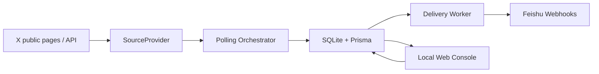

<div align="center">
  
  <h1>AI 前沿雷达</h1>
  <p><strong>本地优先的 AI 公开消息监测工具：监听 X 账号新帖，沉淀到 SQLite，并同步推送到飞书群。</strong></p>
  <p>
    <a href="#快速开始">快速开始</a>
    · <a href="#功能">功能</a>
    · <a href="#配置">配置</a>
    · <a href="#常见问题">常见问题</a>
    · <a href="#开发">开发</a>
  </p>
  <p>
    = 20" src="https://img.shields.io/badge/Node.js-%3E%3D20-3C873A?style=flat-square" />
    
    
    
  </p>
</div>

## English Summary

AI Frontier Radar is a local-first monitor for public X posts. It polls selected AI-related accounts, stores state in SQLite, sends new posts to Feishu webhooks, and provides a local Web dashboard for account, message, delivery, and runtime configuration management.

## 这是什么

AI 领域的重要消息经常先出现在 X 上。这个项目的目标不是做一个公开 SaaS，而是提供一个可本地运行、可持续迭代的个人/小团队消息雷达：

| 能力 | 说明 |
| --- | --- |
| 监听公开 X 账号 | 维护一个账号列表，定时检测新帖 |
| 防止历史消息轰炸 | 首次接入账号时建立基线，不补发旧帖 |
| 飞书群通知 | 支持多个飞书自定义机器人 Webhook |
| 本地 Web 控制台 | 管理账号、查看消息、查看轮询/发送历史、调整配置 |
| SQLite 持久化 | 本地保存账号、帖子、投递事件、运行配置 |
| 浏览器数据源 | 支持代理、匿名抓取测试、登录态检查 |

## 项目边界

本项目仅用于个人本地 AI 前沿公开信息监测和飞书通知。

- 不做黑客攻击。
- 不绕过登录。
- 不破解验证码。
- 不规避平台风控。
- 不采集隐私数据。
- 不进行批量滥用。
- 不上传 Cookie，不保存 X 账号密码，不自动登录。

浏览器模式只使用普通浏览器访问公开页面。如果 X 页面要求登录、限流、验证码或额外验证，本项目不会绕过这些限制。

## 功能

| 模块 | 页面 | 功能 |
| --- | --- | --- |
| 总览 | `/` | 查看运行摘要、手动轮询、手动发送 |
| 监听账号 | `/accounts` | 查询、分页、新增、删除监听账号 |
| 消息内容 | `/posts` | 查看已轮询到的帖子、筛选、详情抽屉、自动刷新 |
| 最近轮询 | `/poll-runs` | 查询、分页、删除、批量删除、清空历史、查看错误 |
| 最近发送 | `/delivery-events` | 查询、分页、删除、批量删除、清空历史 |
| 配置 | `/settings` | 飞书 Webhook、轮询参数、X 数据源、运行信息 |

## 架构



默认运行方式是单机本地运行。SQLite 是状态中心，Web 控制台只允许本机访问。

## 环境要求

| 依赖 | 要求 |
| --- | --- |
| Node.js | `>= 20` |
| npm | 随 Node.js 安装 |
| 浏览器运行环境 | Playwright Chromium，由初始化命令安装 |
| 数据库 | SQLite，本地文件，无需单独安装 |
| Docker | 不需要 |
| Redis | 本地核心功能不强依赖；`/ready` 会检查 Redis，就绪失败不影响 Web 控制台和本地使用 |

## 快速开始

```bash
git clone git@github.com:shi-YangYang/AI-Frontier-Radar.git
cd AI-Frontier-Radar
npm run setup
npm run local
```

启动后打开：

```text
http://127.0.0.1:3000/
```

首次进入 Web 控制台后建议按这个顺序配置：

| 步骤 | 位置 | 做什么 |
| --- | --- | --- |
| 1 | `/settings` -> 飞书配置 | 添加飞书群自定义机器人 Webhook |
| 2 | `/settings` -> X 数据源 | 配置代理或运行匿名抓取测试 |
| 3 | `/accounts` | 添加监听账号，例如 `openai` 或 `@openai` |
| 4 | `/` | 手动触发轮询和发送，确认链路可用 |

## 初始化

首次初始化只需要：

```bash
npm run setup
```

初始化脚本会做这些事：

| 顺序 | 动作 |
| --- | --- |
| 1 | 检查 Node.js 版本 |
| 2 | 如果 `.env` 不存在，则从 `.env.example` 创建 |
| 3 | 安装 npm 依赖 |
| 4 | 生成 Prisma Client |
| 5 | 执行 SQLite migration |
| 6 | 安装 Playwright Chromium |

如果任一步失败，脚本会立即停止，不会继续执行后续步骤。修复错误后重新运行 `npm run setup` 即可。

预览初始化步骤：

```bash
npm run setup:dry-run
```

国内网络如果访问 npm registry 较慢：

```bash
NPM_REGISTRY=https://registry.npmmirror.com/ npm run setup
```

Windows PowerShell：

```powershell
$env:NPM_REGISTRY='https://registry.npmmirror.com/'
npm run setup
```

## 启动

日常启动：

```bash
npm run local
```

`npm run local` 会读取 `.env`，执行 Prisma 生成、数据库迁移、后端/前端构建，然后启动服务。

开发模式：

```bash
npm run dev
```

`npm run dev` 只监听后端源码变化，不会自动构建前端静态资源。首次运行或改动前端后，仍应执行 `npm run build` 或使用 `npm run local`。

## 配置

运行时配置文件：

```text
.env
```

模板文件：

```text
.env.example
```

`npm run setup` 会在 `.env` 不存在时自动创建，不会覆盖已有 `.env`。

### 常用配置

| 配置项 | 默认值 | 说明 |
| --- | --- | --- |
| `SQLITE_PATH` | `.data/ai-news-monitor.sqlite` | SQLite 文件路径 |
| `HOST` | `0.0.0.0` | 服务监听地址 |
| `PORT` | `3000` | 服务端口 |
| `REDIS_URL` | `redis://127.0.0.1:1` | 就绪检查使用；本地核心功能不强依赖 |
| `FEISHU_WEBHOOK_URL` | 空 | 可选启动种子，推荐在 Web 控制台配置 |
| `WATCH_ACCOUNTS_SOURCE` | `database` | 监听账号来源，推荐保持数据库 |
| `POLL_INTERVAL_SECONDS` | `300` | 轮询间隔，也可在 Web 控制台修改 |
| `FETCH_LIMIT_PER_ACCOUNT` | `5` | 每账号单次抓取数量 |
| `EXCLUDE_REPLIES` | `true` | 默认排除回复 |
| `EXCLUDE_REPOSTS` | `true` | 默认排除转发 |

### X 数据源配置

| 配置项 | 默认值 | 说明 |
| --- | --- | --- |
| `X_SOURCE_MODE` | `browser` | `browser` 或 `api` |
| `X_BROWSER_BASE_URL` | `https://x.com` | 浏览器模式访问入口 |
| `X_BROWSER_HEADLESS` | `true` | 是否无头运行 |
| `X_BROWSER_USER_DATA_DIR` | `.x-browser-public-profile` | 浏览器 profile 目录 |
| `X_BROWSER_PROXY_URL` | 空 | 浏览器代理 URL，可在 Web 控制台覆盖 |
| `X_BROWSER_NAVIGATION_TIMEOUT_MS` | `30000` | 页面导航超时 |
| `X_BROWSER_POST_LOAD_TIMEOUT_MS` | `15000` | 帖子加载等待时间 |
| `X_API_BASE_URL` | 空 | API 模式使用 |
| `X_API_BEARER_TOKEN` | 空 | API 模式使用 |

真实的飞书 Webhook、代理认证信息、Token、Cookie、浏览器 profile 都不应该提交到 Git。

## 飞书 Webhook

推荐在 Web 控制台管理：

```text
/settings -> 飞书配置
```

支持：

- 新增多个 Webhook。
- 启用 / 停用单个 Webhook。
- 测试发送。
- 删除 Webhook。
- 只展示脱敏预览，不回显完整 URL。

`.env` 中的 `FEISHU_WEBHOOK_URL` 只是启动种子。如果 SQLite 中已经存在默认投递目标，不会被 `.env` 覆盖。

## X 数据源和代理

默认使用浏览器模式：

```dotenv
X_SOURCE_MODE=browser
```

如果本机或服务器不能直接访问 X，在 `/settings -> X 数据源` 配置 `X_BROWSER_PROXY_URL`，或在 `.env` 中设置：

```dotenv
X_BROWSER_PROXY_URL=http://127.0.0.1:7890
```

支持协议：

| 协议 | 示例 |
| --- | --- |
| `http://` | `http://127.0.0.1:7890` |
| `https://` | `https://proxy.example.com:443` |
| `socks5://` | `socks5://127.0.0.1:7891` |

配置优先级：

```text
Web 控制台 SQLite 配置 > .env 默认值 > 空值
```

Web 控制台只展示脱敏后的当前生效代理 URL。

`X 数据源` 页签提供三个辅助动作：

| 动作 | 说明 |
| --- | --- |
| 匿名抓取测试 | 验证当前网络和代理能否读取公开 X 页面 |
| 登录态检查 | 检查当前 browser profile 是否可用，不读取或展示 Cookie |
| 打开 X 登录窗口 | 仅适用于有图形环境的本机或服务器 |

Linux 纯终端服务器无法直接弹出可见 Chrome 登录窗口。可选方案是使用可访问 X 的代理、VNC/远程桌面登录，或迁移已登录的浏览器 profile；但 profile 不保证跨系统一定可用。

如果有付费 X API，可以切换到 API 模式：

```dotenv
X_SOURCE_MODE=api
X_API_BASE_URL=https://api.x.com
X_API_BEARER_TOKEN=replace-with-real-token
```

## 常用命令

| 命令 | 用途 |
| --- | --- |
| `npm run setup` | 首次初始化 |
| `npm run setup:dry-run` | 预览初始化步骤 |
| `npm run local` | 构建并启动本地服务 |
| `npm run dev` | 后端开发模式 |
| `npm run typecheck` | TypeScript 类型检查 |
| `npm run build` | 后端 + 前端构建 |
| `npm run smoke:e2e` | 本地端到端冒烟，不访问真实 X/飞书 |
| `npm run prisma:generate` | 生成 Prisma Client |
| `npm run prisma:migrate:deploy` | 执行数据库迁移 |
| `npm run playwright:install` | 安装 Chromium |

## 常见问题

<details>
<summary><strong>npm install 失败怎么办？</strong></summary>

`npm run setup` 会立即停止。先看 npm 输出的原始错误，再处理网络、权限、文件占用或安全软件拦截问题。

国内网络可尝试：

```bash
NPM_REGISTRY=https://registry.npmmirror.com/ npm run setup
```

Windows 如果出现 `spawn EPERM`，通常是系统权限、杀毒软件、编辑器占用或 npm 子进程被拦截。关闭占用进程后重试。

</details>

<details>
<summary><strong>Playwright Chromium 下载失败怎么办？</strong></summary>

可单独重试：

```bash
npm run playwright:install
```

服务器网络较差时，先确保能访问 Playwright 下载源，或在服务器上配置系统代理后重试。

</details>

<details>
<summary><strong>/ready 返回 Redis 不可用是否影响本地使用？</strong></summary>

本地使用不要求 Redis 可用。`/health` 和 Web 控制台可正常使用。`/ready` 是依赖就绪检查，默认 Redis 不存在时会返回 `503 DEPENDENCY_UNREADY`。

</details>

<details>
<summary><strong>新增账号失败怎么办？</strong></summary>

先到 `/settings -> X 数据源` 做匿名抓取测试。如果提示网络或代理错误，优先修复代理；如果提示需要登录，说明当前 X 访问策略要求登录态或公开页面不可读。

</details>

<details>
<summary><strong>飞书没有收到消息怎么办？</strong></summary>

检查：

- `/settings -> 飞书配置` 是否至少有一个启用 Webhook。
- Webhook 测试发送是否成功。
- `/delivery-events` 中对应记录的状态和错误信息。
- 首次接入账号只建立基线，不补发历史消息。

</details>

## 项目结构

```text
prisma/                 SQLite schema 和 migrations
scripts/                初始化、Prisma 包装、冒烟脚本
src/app                 Fastify app 组装
src/config              运行时配置加载
src/modules/api         HTTP API 和本地管理 API
src/modules/delivery    飞书发送、worker、retry
src/modules/polling     X 数据源、轮询编排
src/modules/scheduler   本地运行时调度器
src/modules/storage     Prisma storage 和 repository
web/admin               Vue 本地管理前端
```

## 开发

项目采用规格驱动开发（SDD）。较大的功能迭代应先维护 `docs/specs/<feature-id>/` 下的需求、设计、实施计划和验收记录，再进入代码实现。

每次版本验收后至少同步：

- `README.md`
- 对应 feature 的 `handoff.md`
- 对应 feature 的 `verification/acceptance.md`
- 必要时更新 `prompts/context-recovery.md`

## 许可证

本项目使用 [MIT License](./LICENSE) 开源。
