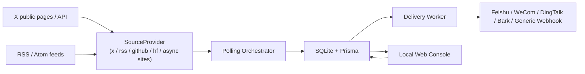

<div align="center">
  
  <h1>AI 前沿雷达</h1>
  <p><strong>本地优先的 AI 公开消息监测工具：聚合 X 账号、官方博客与 RSS 订阅源，沉淀到 SQLite，并通过飞书 / 企业微信 / 钉钉 / Bark / 通用 Webhook 多渠道推送。</strong></p>
  <p>
    <a href="#快速开始">快速开始</a>
    · <a href="#功能">功能</a>
    · <a href="#技术原理">技术原理</a>
    · <a href="#配置">配置</a>
    · <a href="#常见问题">常见问题</a>
    · <a href="#支持这个项目">支持</a>
  </p>
</div>

<div align="center">

[](https://github.com/shi-YangYang/AI-Frontier-Radar/actions/workflows/ci.yml)
[](./LICENSE)
[](https://github.com/shi-YangYang/AI-Frontier-Radar/stargazers)
[](https://github.com/shi-YangYang/AI-Frontier-Radar/forks)
[](https://github.com/shi-YangYang/AI-Frontier-Radar/issues)
[](#支持这个项目)


</div>

## English Summary

AI Frontier Radar is a local-first monitor for public AI news sources. It polls X accounts, official blogs (Anthropic, AI2, Moonshot, Meta AI, xAI, ...) and RSS/Atom feeds, stores everything in SQLite, and pushes new posts to Feishu / WeCom / DingTalk / Bark / generic webhooks with per-channel subscription rules. A local Web dashboard manages sources, messages, delivery, data retention, backups and runtime logs.

## 这是什么

AI 领域的重要消息经常先出现在 X 上。这个项目的目标不是做一个公开 SaaS，而是提供一个可本地运行、可持续迭代的个人/小团队消息雷达：

| 能力 | 说明 |
| --- | --- |
| 监听公开 X 账号 | 维护一个账号列表，定时检测新帖 |
| 监听 RSS/Atom 订阅源 | 添加官方博客、媒体、Newsletter 等 feed URL，与 X 账号统一管理 |
| 防止历史消息轰炸 | 新来源首轮只锚定最新 1 条，之后只收录新内容（榜单型源首轮全量不入推送） |
| 多渠道通知 | 飞书 / 企业微信 / 钉钉 / Bark / 通用 Webhook，可配分渠道订阅规则 |
| 本地 Web 控制台 | 管理订阅源、查看消息、查看轮询/发送历史、调整配置 |
| SQLite 持久化 | 本地保存订阅源、帖子、投递事件、运行配置 |
| 浏览器数据源 | 支持代理、匿名抓取测试、登录态检查 |

## 项目边界

本项目仅用于个人本地 AI 前沿公开信息监测和飞书通知。

- 不做黑客攻击。
- 不绕过登录。
- 不破解验证码。
- 不规避平台风控。
- 不采集隐私数据。
- 不进行批量滥用。
- 不上传 Cookie，不保存 X 账号密码，不自动登录。

浏览器模式只使用普通浏览器访问公开页面。如果 X 页面要求登录、限流、验证码或额外验证，本项目不会绕过这些限制。

## 功能

| 模块 | 页面 | 功能 |
| --- | --- | --- |
| 总览 | `/` | 查看运行摘要、手动轮询、手动发送 |
| 监听源 | `/accounts` | 查询、分页、新增、删除 X 账号、官方博客与 RSS 源；删除源级联清理其数据 |
| 消息内容 | `/posts` | 查看已轮询到的帖子、筛选、详情抽屉、自动刷新、一键清空 |
| 最近轮询 | `/poll-runs` | 查询、分页、删除、批量删除、清空历史、查看错误 |
| 最近发送 | `/delivery-events` | 查询、分页、删除、批量删除、清空历史 |
| 配置 | `/settings` | 投递通道、轮询参数、X 数据源、订阅规则、数据与备份、运行信息 |
| 运行日志 | `/logs` | 最近 500 条运行日志，级别筛选与自动刷新 |

## 架构



默认运行方式是单机本地运行。SQLite 是状态中心，Web 控制台只允许本机访问。

## 技术原理

| 机制 | 说明 |
| --- | --- |
| 源适配器（SourceProvider） | 每个来源实现统一接口（抓取 → 解析 → 标准化 → 去重键），X / RSS / GitHub / HF / Anthropic / AI2 / Moonshot / Meta / xAI 共用同一轮询、投递与规则链路；新增来源只需实现一个 provider |
| 基线 + 游标（watermark） | 新来源首轮只锚定最新 1 条入库，之后只收录比游标更新的条目——用"水位线"机制避免接入即被历史消息轰炸；榜单型来源（GitHub Trending / HF Daily Papers）例外：首轮全量入库但不推送 |
| 稳定 ID + 去重键 | 每个条目生成稳定 ID（发布时间毫秒 + 内容指纹）与去重键，重复轮询幂等跳过，不产生重复消息与重复推送 |
| 通道注册表 | 投递侧按 `channelType` 分发到飞书 / 企业微信 / 钉钉（HMAC 加签）/ Bark / 通用 Webhook；失败区分可重试性（网络与 5xx 重试，业务码错误不重试） |
| 本地优先 | SQLite 是唯一事实来源，全程无云依赖；本地 Feed（RSS / JSON Feed）、导出、备份都从本地数据生成 |

## 环境要求

| 依赖 | 要求 |
| --- | --- |
| Node.js | `>= 20` |
| npm | 随 Node.js 安装 |
| 浏览器运行环境 | Playwright Chromium，由初始化命令安装 |
| 数据库 | SQLite，本地文件，无需单独安装 |
| Docker | 不需要 |
| Redis | 本地核心功能不强依赖；`/ready` 会检查 Redis，就绪失败不影响 Web 控制台和本地使用 |

## 快速开始

```bash
git clone git@github.com:shi-YangYang/AI-Frontier-Radar.git
cd AI-Frontier-Radar
npm run setup
npm run local
```

启动后打开：

```text
http://127.0.0.1:3000/
```

首次启动会自动创建管理员账号：

- 在 `.env` 配置 `ADMIN_USERNAME` / `ADMIN_PASSWORD` 时按其创建；
- 未配置时生成随机密码并打印在启动日志中（`未配置 ADMIN_PASSWORD，已生成初始管理员密码：...`）。

所有页面（包括本机）都需要登录：

| 入口 | 说明 |
| --- | --- |
| `/login` | 登录页；管理员登录后进入管理台，普通用户登录后进入 `/portal` |
| `/portal` | 普通用户页：只能绑定/解绑自己的微信，查看推送状态 |
| `/settings` -> 用户 | 管理员创建/删除用户、重置密码（首个管理员由 `.env` 种子创建） |

首次进入 Web 控制台后建议按这个顺序配置：

| 步骤 | 位置 | 做什么 |
| --- | --- | --- |
| 1 | `/settings` -> 投递通道 | 添加飞书 / 企业微信 / 钉钉 / Bark / 通用 Webhook 通道并测试发送 |
| 2 | `/settings` -> X 数据源 | 配置代理或运行匿名抓取测试 |
| 3 | `/accounts` | 添加监听源：X 账号（例如 `openai` 或 `@openai`）或 RSS 源（例如 `https://openai.com/blog/rss.xml`） |
| 4 | `/` | 手动触发轮询和发送，确认链路可用 |

## 初始化

首次初始化只需要：

```bash
npm run setup
```

初始化脚本会做这些事：

| 顺序 | 动作 |
| --- | --- |
| 1 | 检查 Node.js 版本 |
| 2 | 如果 `.env` 不存在，则从 `.env.example` 创建 |
| 3 | 安装 npm 依赖 |
| 4 | 生成 Prisma Client |
| 5 | 执行 SQLite migration |
| 6 | 安装 Playwright Chromium |

如果任一步失败，脚本会立即停止，不会继续执行后续步骤。修复错误后重新运行 `npm run setup` 即可。

预览初始化步骤：

```bash
npm run setup:dry-run
```

国内网络如果访问 npm registry 较慢：

```bash
NPM_REGISTRY=https://registry.npmmirror.com/ npm run setup
```

Windows PowerShell：

```powershell
$env:NPM_REGISTRY='https://registry.npmmirror.com/'
npm run setup
```

## 启动

日常启动：

```bash
npm run local
```

`npm run local` 会读取 `.env`，执行 Prisma 生成、数据库迁移、后端/前端构建，然后启动服务。

开发模式：

```bash
npm run dev
```

`npm run dev` 只监听后端源码变化，不会自动构建前端静态资源。首次运行或改动前端后，仍应执行 `npm run build` 或使用 `npm run local`。

## 配置

运行时配置文件：

```text
.env
```

模板文件：

```text
.env.example
```

`npm run setup` 会在 `.env` 不存在时自动创建，不会覆盖已有 `.env`。

### 常用配置

| 配置项 | 默认值 | 说明 |
| --- | --- | --- |
| `SQLITE_PATH` | `.data/ai-news-monitor.sqlite` | SQLite 文件路径 |
| `HOST` | `0.0.0.0` | 服务监听地址 |
| `PORT` | `3000` | 服务端口 |
| `REDIS_URL` | `redis://127.0.0.1:1` | 就绪检查使用；本地核心功能不强依赖 |
| `FEISHU_WEBHOOK_URL` | 空 | 可选启动种子，推荐在 Web 控制台配置 |
| `ADMIN_USERNAME` | `admin` | 首个管理员用户名；仅在用户表为空时生效 |
| `ADMIN_PASSWORD` | 随机生成 | 首个管理员密码；未配置时随机密码打印在启动日志 |
| `WATCH_ACCOUNTS_SOURCE` | `database` | X 账号启动种子来源，推荐保持数据库 |
| `POLL_INTERVAL_SECONDS` | `300` | 轮询间隔（秒）；Web 控制台按分钟配置（1-3600 分钟） |
| `FETCH_LIMIT_PER_ACCOUNT` | `5` | 每账号单次抓取数量 |
| `EXCLUDE_REPLIES` | `true` | 默认排除回复 |
| `EXCLUDE_REPOSTS` | `true` | 默认排除转发 |

### X 数据源配置

| 配置项 | 默认值 | 说明 |
| --- | --- | --- |
| `X_SOURCE_MODE` | `browser` | `browser` 或 `api` |
| `X_BROWSER_BASE_URL` | `https://x.com` | 浏览器模式访问入口 |
| `X_BROWSER_HEADLESS` | `true` | 是否无头运行，可在 Web 控制台 X 数据源中覆盖 |
| `X_BROWSER_USER_DATA_DIR` | `.x-browser-public-profile` | 浏览器 profile 目录 |
| `X_BROWSER_PROXY_URL` | 空 | 浏览器代理 URL，可在 Web 控制台覆盖 |
| `X_BROWSER_NAVIGATION_TIMEOUT_MS` | `30000` | 页面导航超时 |
| `X_BROWSER_POST_LOAD_TIMEOUT_MS` | `15000` | 帖子加载等待时间 |
| `X_API_BASE_URL` | 空 | API 模式使用 |
| `X_API_BEARER_TOKEN` | 空 | API 模式使用 |
| `RSS_PROXY_URL` | 空 | RSS 抓取代理（仅 http/https），可在 Web 控制台 RSS 源中覆盖 |

真实的飞书 Webhook、代理认证信息、Token、Cookie、浏览器 profile 都不应该提交到 Git。

## 飞书 Webhook

推荐在 Web 控制台管理（`/settings -> 投递通道`，支持飞书 / 企业微信 / 钉钉 / Bark / 通用 Webhook，详见 [投递通道](#投递通道)）：

- 新增多个通道，启用 / 停用单个通道。
- 对任意通道测试发送。
- 删除通道；列表只展示脱敏预览，不回显完整 URL。

`.env` 中的 `FEISHU_WEBHOOK_URL` 只是启动种子。如果 SQLite 中已经存在默认投递目标，不会被 `.env` 覆盖。

## X 数据源和代理

默认使用浏览器模式：

```dotenv
X_SOURCE_MODE=browser
```

如果本机或服务器不能直接访问 X，在 `/settings -> X 数据源` 配置 `X_BROWSER_PROXY_URL`，或在 `.env` 中设置：

```dotenv
X_BROWSER_PROXY_URL=http://127.0.0.1:7890
```

> 注意：X 会拦截暴露 `HeadlessChrome` 标识的无头浏览器。本项目在无头模式下会自动伪装该标识（UA 与 Client Hints）；如需切换无头/有头，到 `/settings -> X 数据源 -> 浏览器运行模式` 设置即可，无需修改 `.env`。

支持协议：

| 协议 | 示例 |
| --- | --- |
| `http://` | `http://127.0.0.1:7890` |
| `https://` | `https://proxy.example.com:443` |
| `socks5://` | `socks5://127.0.0.1:7891` |

配置优先级：

```text
Web 控制台 SQLite 配置 > .env 默认值 > 空值
```

Web 控制台只展示脱敏后的当前生效代理 URL。

`X 数据源` 页签提供三个辅助动作：

| 动作 | 说明 |
| --- | --- |
| 匿名抓取测试 | 验证当前网络和代理能否读取公开 X 页面 |
| 登录态检查 | 检查当前 browser profile 是否可用，不读取或展示 Cookie |
| 打开 X 登录窗口 | 仅适用于有图形环境的本机或服务器 |

Linux 纯终端服务器无法直接弹出可见 Chrome 登录窗口。可选方案是使用可访问 X 的代理、VNC/远程桌面登录，或迁移已登录的浏览器 profile；但 profile 不保证跨系统一定可用。

如果有付费 X API，可以切换到 API 模式：

```dotenv
X_SOURCE_MODE=api
X_API_BASE_URL=https://api.x.com
X_API_BEARER_TOKEN=replace-with-real-token
```

## RSS 订阅源

在 `/accounts` 页面把新增类型切换为 `RSS 源`，填入 feed URL 即可添加（仅支持 http/https 绝对地址）。列表展示来源类型、feed 标题与最近轮询状态。

| 项 | 说明 |
| --- | --- |
| Feed 格式 | RSS 2.0、Atom；RSS 1.0 / RDF 尽力支持 |
| 抓取方式 | 直接 HTTP GET，30 秒超时，固定 User-Agent，跟随跳转 |
| 内容范围 | 只使用 feed 提供的 title / description / content，不抓取全文 |
| HTML 处理 | 去标签并解码常见实体，正文截断到 4000 字 |
| 日期 | 使用 pubDate / published / updated；缺失时回退为抓取时刻 |
| 去重 | 稳定去重键（feed URL + guid/link 的哈希）；缺日期条目跨轮不会重复入库 |
| 代理 | 支持 `RSS_PROXY_URL` 或在 `/settings -> RSS 源` 配置 http/https 代理 |
| 错误处理 | 404/410 → 源不存在；其他非 2xx → 请求失败；解析失败 → 内容无效；单个源失败不影响其他源 |

没有启用中的监听源时，轮询会自动跳过（不产生轮询记录）；「立即轮询」也会返回"已跳过"。

RSS 与 X 走同一条基线 / 增量 / 去重 / 入库 / 投递链路：首次接入只建立基线（最新 1 条），之后只入库新条目；有启用的飞书 Webhook 时同步创建投递事件。

需要出网代理时，在 `/settings -> RSS 源` 保存代理（优先级：Web 控制台 > `.env` 的 `RSS_PROXY_URL`）。仅支持 `http://` 与 `https://`，不支持 `socks5://`。

初始化后监听源为空，默认不监听任何内容。可在 `/accounts` 顶部的“监听组合”中一键添加常用源（当前提供「AI 消息」组：arXiv 四分类、HF Daily Papers、Techmeme、Hacker News、Reddit r/LocalLLaMA、Product Hunt、OpenAI、Google AI、DeepMind、量子位、GitHub Trending 热门仓库）；重复应用会自动跳过已存在的源。

### 按来源添加（预设）

`/accounts` 的“添加监听源”支持按来源类型直接添加，自动转换为标准 feed URL：

| 类型 | 输入 | 生成地址 |
| --- | --- | --- |
| RSS / 播客 | feed URL | 原样 |
| YouTube 频道 | `@handle`、频道链接或 `UC...` 频道 ID | `youtube.com/feeds/videos.xml?channel_id=...`（服务端解析） |
| Reddit 子版块 | 子版块名 + 排序（热门/最新/最高） | `reddit.com/r/<name>/<sort>/.rss` |
| arXiv | 分类（cs.AI / cs.CL / cs.CV / cs.LG / cs.RO / stat.ML） | `export.arxiv.org/rss/<category>` |
| Hacker News | 首页 / 最新 / ≥100 分 / ≥300 分 | `hnrss.org/...` |
| Product Hunt | 无需输入 | `producthunt.com/feed` |
| HF Daily Papers | 无需输入 | `huggingface.co/api/daily_papers`（JSON API） |
| Anthropic 新闻 | 无需输入 | `anthropic.com/news`（服务端解析页面） |
| Meta AI 博客 | 无需输入 | `ai.meta.com/blog`（无头浏览器渲染） |
| xAI 新闻 | 无需输入 | `x.ai/news`（无头浏览器渲染） |
| AI2 博客 | 无需输入 | `allenai.org/blog`（服务端解析页面） |
| Moonshot 博客 | 无需输入 | `platform.moonshot.cn/blog`（服务端解析页面） |
| GitHub 热门仓库 | 周期（每日/每周/每月）+ 可选语言 | `github.com/trending[/<lang>]?since=...`（服务端解析页面） |
| GitHub 仓库发布 | `owner/repo` | `github.com/<owner>/<repo>/releases.atom` |
| GitHub 用户动态 | 用户名 | `github.com/<user>.atom` |

YouTube 解析与 GitHub 页面抓取遵循“RSS 源”页签里的代理配置；GitHub 热门仓库首次接入会把当前榜单整体作为基线入库（不推送），之后只有新进入榜单的仓库才会推送。

## 监听组合

`/accounts` 顶部提供内置监听组合，一键添加一组常用源（已存在的自动跳过）：

| 组合 | 内容 |
| --- | --- |
| AI 消息 | arXiv cs.AI / cs.CL / cs.LG / cs.CV、HF Daily Papers、Techmeme、Hacker News、Reddit r/LocalLLaMA、Product Hunt、OpenAI News、Google AI、Google DeepMind、Anthropic News、AI at Meta、xAI News、AI2 Blog、Moonshot Blog、Mistral、Stability AI、Hugging Face Blog、量子位、GitHub Trending（每日） |

初始化后监听源为空，不会自动添加任何源；首次轮询只建立基线，不推送历史内容。

## 收录规则与删除

- 新添加的源**首轮仅入库最新 1 条**（作为基准并投递），之后只收录比基准更新的内容——不会把历史旧文一次性灌入。
- 例外：榜单型源（GitHub Trending、HF Daily Papers）首轮全量入库但不推送——它们本身就是当天榜单，不存在旧文问题。
- **删除监听源会连同其全部消息与投递记录一并删除**（界面会二次确认），重新添加后按新源重新锚定基准。

## 本地 Feed 输出

外部阅读工具可直接订阅本机数据（无需鉴权）：

| 地址 | 格式 | 说明 |
| --- | --- | --- |
| `http://127.0.0.1:3000/feed.xml` | RSS 2.0 | 最新内容 |
| `http://127.0.0.1:3000/feed.json` | JSON Feed 1.1 | 最新内容 |

参数：`?limit=50`（默认 50，最大 200）；`?matched=1` 仅输出命中启用“订阅规则”的内容（没有启用规则时等同全量）。

## 投递通道

支持多通道并发投递，`/settings -> 投递通道` 添加与测试：

| 渠道 | 说明 | 需要的配置 |
| --- | --- | --- |
| 飞书机器人 | 群自定义机器人 Webhook | Webhook URL |
| 企业微信机器人 | 群机器人 Webhook（markdown） | Webhook URL |
| 钉钉机器人 | 群机器人 Webhook（markdown） | Webhook URL；若安全设置选"加签"，需填加签密钥 |
| Bark | iOS 推送 | 完整推送地址 `https://api.day.app/<deviceKey>` |
| 通用 Webhook | 任意系统对接，POST JSON（author/title/url/postedAt/text） | Webhook URL |
| 微信（ClawBot） | 通过主服务内置的轻量桥推送到**个人微信**（微信官方 ClawBot 通道，无需 OpenClaw） | 可选目标会话（默认发到最近登记的会话） |

- 新消息会按订阅规则投递到所有匹配的启用通道；失败的投递按既有重试策略处理（网络/5xx 重试，业务码错误不重试）。

## 微信桥（个人微信推送）

微信官方为 AI 智能体提供了 ClawBot 插件通道（扫码绑定，非第三方 hook）。本项目内置一个**独立轻量桥**（`wechat-bridge/`），直接复用腾讯官方插件（MIT）的登录与发送协议，**不需要安装 OpenClaw**。

### 使用步骤

```bash
npm run wechat:install   # 安装桥依赖（仅首次）
npm run local            # 正常启动雷达（主服务会自动托管微信桥）
```

1. 打开 `/settings -> 微信`，点击「扫码登录」，用手机微信扫描页面上的二维码；
2. 若微信提示输入数字，在页面输入并提交；
3. 登录成功后，在微信里给 **ClawBot** 随便发一条消息（用于登记会话目标）；
4. 点击「测试发送」确认收到消息。绑定完成后该微信号**默认自动接收推送**，无需其他配置。

### 用户端（/portal）

- 顶部页签：**消息**（浏览全部入库消息，含来源/标题/正文/原文链接，分页加载）与**微信推送**（绑定、会话状态、额度、夜间静默、按源过滤）；
- 绑定流程：扫码前提示「绑定后需发一条消息」；扫码成功但会话未激活时会持续检测并提示；激活后显示「会话已同步，可以接收推送」；
- **额度进度条**：显示本窗口已推送条数（默认 10 条/24 小时，发消息给 ClawBot 后重置）。

### 按源过滤（普通用户）

- 普通用户登录后打开 `/portal`，在绑定卡片里点「设置」，即可选择这个微信号**接收哪些监听源**：
  - 默认「全部源」；切换「自选源」后按组（AI 官方源 / 论文与榜单 / 开发者 / 资讯与社区 / X 账号）勾选；
  - 未勾选的源不会再推送到这个微信号，其他绑定不受影响；保存后立即生效。
- 每个用户**只能绑定一个微信号**；如需更换，先解绑当前微信再重新扫码。
- 监听源页支持**一键删除全部监听源**（二次确认，连同消息与投递记录一并清理，不可恢复）。

### 会话激活与平台限制（重要）

微信 ClawBot 是**被动会话**协议：bot 不能主动发起对话。

- 绑定后（以及长时间未互动后），需要用该微信号给 ClawBot **发送任意一条消息**，推送才能到达；
- 微信侧限制：用户 **24 小时**未互动，会话凭证（`context_token`）失效；24 小时内主动推送有**条数额度**（社区实测约 10 条）；
- 本桥会缓存收到消息时的凭证并用于后续发送（与官方插件一致），并在 `GET /accounts` 暴露 `hasContextToken`；雷达的 `/portal` 页面在会话未激活时会给出提示；
- 会话失效时推送会明确失败且**不重试**（避免消耗额度），日志提示需要重新发消息激活；
- 每条微信推送底部带额度提示：`当前消息[n/10]`，达到上限时附加「【当前消息容量已满，请发送一条消息重置】」。

### 多账号与推送开关

- 「微信」页签可绑定**多个微信号**：每个微信号各自扫码一次（「添加微信（扫码）」），列表可见并可按需删除。
- **绑定即默认接收推送**（系统自动为每个账号创建并维护投递通道）；如需某个微信号只登录不推送，关闭它所在行的「接收推送」开关即可。
- 微信通道不会出现在「投递通道」列表中（避免与管理入口重复），启停以「接收推送」开关为准。
- 官方限制：一个微信号同一时间只能绑定一个 bot 后端（绑定其他平台/实例会顶替当前绑定）；多账号只是让多个微信分别连到本桥。

### 说明

- 桥由主服务自动启动/停止，无需单独运行；`npm run wechat:login` / `wechat:serve` / `wechat:status` / `wechat:targets` 保留用于调试。
- 桥只发送文本（标题 + 正文 + 原文链接），不接收/回复微信消息（仅登记会话目标）。

## 订阅规则（推送过滤）

在 `/settings -> 订阅规则` 配置关键词规则：**只有命中任一启用规则的帖子才会推送**；帖子始终入库，可在 `/posts` 查看。未配置规则或全部停用时，保持全量推送。

每条规则可选择「生效通道」：不勾选 = 对所有通道生效；勾选后该规则只推送到所选通道（例如 CCF-A 规则只发飞书、不打扰手机推送）。多条规则命中的通道取并集。

| 字段 | 说明 |
| --- | --- |
| 包含词 | 逗号分隔；匹配方式可选“任一命中”或“全部命中（共现）” |
| 排除词 | 命中任一排除词即不推送（优先于包含词） |
| 启用 | 停用的规则不参与匹配 |

示例：规则「CCF-A 顶会」包含 `NeurIPS, ICML, ICLR, CVPR, ACL`（任一命中），排除 `workshop`，即可近似实现按会议名过滤。

## 数据管理

### 帖子导出

- 管理台「消息内容」右上角提供 **导出 CSV / 导出 JSON**，按当前筛选条件导出。
- 接口：`GET /admin/api/posts/export?format=csv|json`，支持 `authorUsername`、`postedFrom`、`postedTo`、`query`、`isReply`、`isRepost`、`limit`（默认 20000，最大 50000）。
- CSV 带 UTF-8 BOM，可直接用 Excel 打开。

### 数据保留策略

- `/settings -> 数据与备份`：保留天数（0 = 关闭，默认关闭），按发布时间清理旧帖子与投递事件。
- 每日随轮询自动执行一次（间隔 ≥24 小时），也可「立即清理」，界面上会先显示将删除的条目数并二次确认。

## 数据库备份与恢复

- `/settings -> 数据与备份` 可「立即备份」、下载或删除备份；使用 SQLite `VACUUM INTO` 生成一致性快照，自动保留最近 10 份（`.data/backups/`）。
- 恢复（需先停止服务）：

```bash
npm run db:restore -- .data/backups/backup-20260917-143646.sqlite
```

脚本会校验备份文件、检测服务是否仍在运行，并自动把当前数据库另存为 `pre-restore-<时间戳>.sqlite` 快照后再替换。加 `--check` 只做校验。

## 运行日志

`/logs` 页面展示当前进程最近 500 条日志（内存缓冲，重启后清空），支持级别筛选（info / warn / error）与自动刷新。日志接口为 `GET /admin/api/logs`，敏感字段沿用脱敏规则。

## CI

向 `master`（或 `main`）发起 Pull Request 时会自动触发 GitHub Actions 校验：

```text
npm run prisma:generate → npm run typecheck → npm run build → npm run smoke:e2e
```

工作流文件：`.github/workflows/ci.yml`。推送分支本身不触发；只有 PR 打开/更新时运行（上方 CI 徽章跟踪 `dev` 分支最近一次运行）。

## 常用命令

| 命令 | 用途 |
| --- | --- |
| `npm run setup` | 首次初始化 |
| `npm run setup:dry-run` | 预览初始化步骤 |
| `npm run local` | 构建并启动本地服务 |
| `npm run dev` | 后端开发模式 |
| `npm run typecheck` | TypeScript 类型检查 |
| `npm run build` | 后端 + 前端构建 |
| `npm run smoke:e2e` | 本地端到端冒烟，不访问真实 X/飞书 |
| `npm run prisma:generate` | 生成 Prisma Client |
| `npm run prisma:migrate:deploy` | 执行数据库迁移 |
| `npm run playwright:install` | 安装 Chromium |
| `npm run db:restore -- <备份文件>` | 用备份恢复数据库（需先停服） |
| `npm run wechat:install` | 安装微信桥依赖（wechat-bridge） |
| `npm run wechat:login` | 微信扫码登录（ClawBot 通道） |
| `npm run wechat:serve` | 启动微信桥服务 |
| `npm run wechat:status` | 查看微信桥登录状态 |

## 常见问题

<details>
<summary><strong>npm install 失败怎么办？</strong></summary>

`npm run setup` 会立即停止。先看 npm 输出的原始错误，再处理网络、权限、文件占用或安全软件拦截问题。

国内网络可尝试：

```bash
NPM_REGISTRY=https://registry.npmmirror.com/ npm run setup
```

Windows 如果出现 `spawn EPERM`，通常是系统权限、杀毒软件、编辑器占用或 npm 子进程被拦截。关闭占用进程后重试。

</details>

<details>
<summary><strong>Playwright Chromium 下载失败怎么办？</strong></summary>

可单独重试：

```bash
npm run playwright:install
```

服务器网络较差时，先确保能访问 Playwright 下载源，或在服务器上配置系统代理后重试。

</details>

<details>
<summary><strong>/ready 返回 Redis 不可用是否影响本地使用？</strong></summary>

本地使用不要求 Redis 可用。`/health` 和 Web 控制台可正常使用。`/ready` 是依赖就绪检查，默认 Redis 不存在时会返回 `503 DEPENDENCY_UNREADY`。

</details>

<details>
<summary><strong>新增账号失败怎么办？</strong></summary>

先到 `/settings -> X 数据源` 做匿名抓取测试。如果提示网络或代理错误，优先修复代理；如果提示需要登录，说明当前 X 访问策略要求登录态或公开页面不可读。

</details>

<details>
<summary><strong>新增 RSS 源失败怎么办？</strong></summary>

按错误提示区分处理：

- 源不存在（feed 返回 404/410）：确认 URL 是否可公开访问。
- 网络请求失败：检查本机网络、服务器出口或目标站点可达性。
- 内容无法解析：确认地址返回的是 RSS/Atom XML，而不是网页或 JSON。
- URL 无效：必须是完整的 `http://` 或 `https://` 地址。

</details>

<details>
<summary><strong>飞书没有收到消息怎么办？</strong></summary>

检查：

- `/settings -> 投递通道` 是否至少有一个启用通道。
- 通道的「测试发送」是否成功。
- `/delivery-events` 中对应记录的状态和错误信息。
- 首次接入账号只建立基线，不补发历史消息。

</details>

## 项目结构

```text
AGENTS.md               Agent 开发规范与协作流程
constitution/           项目使命、路线图、技术栈（长期约束）
specs/                  SDD 规格目录（spec / plan / acceptance 与模板）
.ai/                    决策留痕、工作流、提示词、规则
prisma/                 SQLite schema 和 migrations
scripts/                初始化、Prisma 包装、冒烟脚本
src/app                 Fastify app 组装
src/config              运行时配置加载
src/modules/api         HTTP API 和本地管理 API
src/modules/delivery    飞书发送、worker、retry
src/modules/polling     X / RSS 数据源、轮询编排
src/modules/scheduler   本地运行时调度器
src/modules/storage     Prisma storage 和 repository
web/admin               Vue 本地管理前端
```

## 开发

项目遵循规格驱动开发（SDD），并融合多 Agent 协作模式，完整流程与硬性约束见 [AGENTS.md](./AGENTS.md)。

| 结构 | 职责 |
| --- | --- |
| `constitution/` | 项目使命、路线图、技术栈等长期约束 |
| `specs/spec-XXX-short-name/` | 需求规格 `spec.md`、实施计划 `plan.md`、验收记录 `acceptance.md` |
| `.ai/` | 决策留痕、工作流、提示词、项目规则 |

较大的功能迭代：先维护 `specs/spec-XXX-*/` 下的 `spec.md` 与 `plan.md`，关键决策确认后实施；实施完成后由独立验收产出 `acceptance.md`，未通过则进入返工流程，直到 PASS。

任何 Agent 任务开始前，按 AGENTS.md 第 11 节顺序阅读固定必读与任务必读文档。项目行为变化时，同步更新本 README 与相关文档。

## 支持这个项目

如果这个项目对你有帮助，欢迎给一个 ⭐ **Star**，这能让更多需要「AI 前沿雷达」的人看到它。

- ⭐ **Star**：[点个 Star](https://github.com/shi-YangYang/AI-Frontier-Radar/stargazers)，这是对项目最直接的支持
- 🍴 **Fork**：[Fork 一份](https://github.com/shi-YangYang/AI-Frontier-Radar/forks)，改成你自己的雷达（换来源、换通道、换规则都很容易）
- 🐛 **反馈**：Bug、建议、新来源需求，欢迎提 [Issue](https://github.com/shi-YangYang/AI-Frontier-Radar/issues)
- 🔧 **贡献**：PR 一律欢迎；项目遵循 SDD 流程，较大的改动建议先开 Issue 对齐，并按 `specs/` 约定补充规格与验收

[](https://star-history.com/#shi-YangYang/AI-Frontier-Radar&Date)

## 许可证

本项目使用 [MIT License](./LICENSE) 开源。
