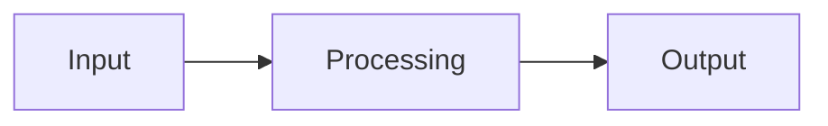

# <Feature Title> - Design

## Feature ID

`v2-XXX-short-name`

## Status

`draft`

## Architecture Summary

Short description of the implementation approach.

## Data Flow

## Module Impact

- `src/module`: change summary

## Data Model Changes

Tables, fields, indexes, migrations, and compatibility notes.

## API / Config Changes

Routes, request/response contracts, environment variables, defaults.

## Failure Modes

- Failure mode: expected behavior.

## Migration Plan

How existing V1 data/config keeps working.

## Test Strategy

- Unit-level checks
- Smoke checks
- Manual checks

## Open Design Questions

- [ ] Question.
