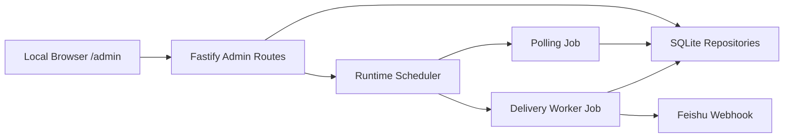

# Local Web Management - Design

## Feature ID

`v1-1-001-local-web-management`

## Status

`draft`

## Architecture Summary

Use Fastify to serve a simple local admin page and JSON endpoints. Avoid adding a frontend framework. The page can be plain HTML/CSS/JavaScript served by the backend.

The backend should reuse existing repository, polling job, delivery worker, and scheduler logic. It must not implement a second polling or delivery path.

## Data Flow



## Module Impact

- `src/modules/api/*`: add admin page route and admin JSON endpoints.
- `src/app/create-app.ts`: register admin routes.
- `src/modules/storage/*`: add repository methods for recent poll runs, recent delivery events, and account updates if missing.
- `src/modules/scheduler/*`: expose manual trigger methods safely to API.
- `src/server/start-server.ts`: pass scheduler or runtime actions into app if needed.

## Data Model Changes

No schema changes required for V1.1 local admin.

Existing tables are sufficient:

- `watch_accounts`
- `poll_runs`
- `delivery_events`
- `x_posts_raw`
- `delivery_targets`

## API / Config Changes

Proposed routes:

- `GET /admin`: HTML page
- `GET /admin/api/summary`: admin summary
- `GET /admin/api/watch-accounts`: list accounts
- `POST /admin/api/watch-accounts`: add account
- `PATCH /admin/api/watch-accounts/:id`: enable/disable account
- `GET /admin/api/poll-runs`: recent poll runs
- `GET /admin/api/delivery-events`: recent delivery events
- `POST /admin/api/actions/poll-now`: manual polling trigger
- `POST /admin/api/actions/delivery-now`: manual delivery trigger

No new required environment variables.

## Failure Modes

- Manual polling while polling is running: return skipped/already-running response.
- Invalid username: return `400 INVALID_REQUEST`.
- Account not found: return `404 NOT_FOUND`.
- Repository error: return `500 INTERNAL_ERROR`.
- Browser scraping failure: recorded in account `last_poll_error`, shown in UI.

## Migration Plan

No migration required.

Existing users can start service and open:

```text
http://127.0.0.1:3000/admin
```

## Test Strategy

- Typecheck and build.
- Fastify inject tests via script or smoke for admin JSON endpoints.
- Manual browser check for `/admin`.
- Verify no full webhook URL appears in admin responses or page HTML.
- Verify disabling an account removes it from `listEnabled()`.

## Open Design Questions

- [ ] Should recent delivery events include post text snippets or only IDs/status?
- [ ] Should manual polling return full run summary or only accepted/skipped?
